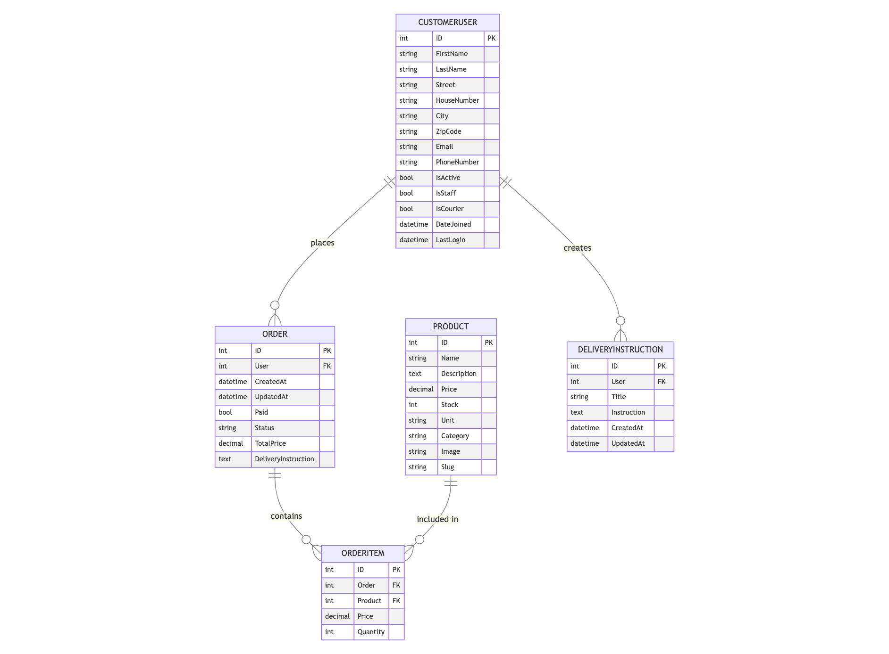

# Green Local Veggies

## Online Fresh Produce Delivery Platform

Green Local Veggies is a Django-based e-commerce application designed to facilitate the online ordering and delivery of fresh, locally-sourced fruits and vegetables in Westerstede, Germany. This project aims to bridge the gap between local farmers and urban consumers, promoting sustainable food practices and supporting the local economy.

### Project Overview

The Green Local Veggies platform offers a user-friendly interface for customers to browse, select, and purchase fresh produce online. It incorporates a robust backend system for order management, user authentication, and a courier dashboard for efficient delivery logistics. The application is built with scalability and maintainability in mind, utilizing modern web technologies and following best practices in web development.

[Live Demo](https://p4-green-local-veggies-c5f2f4c33912.herokuapp.com/)

### Key Features

- User authentication and profile management
- Product catalog with categories for fruits and vegetables
- Advanced search and filter capabilities
- Shopping cart functionality
- Secure checkout process with Stripe integration
- Order tracking for customers
- Staff dashboard for order management
- Courier dashboard for delivery management
- Responsive design for optimal viewing on various devices

### Target Audience

- Local residents of Westerstede seeking fresh, locally-sourced fruits and vegetables
- Health-conscious consumers interested in supporting local agriculture
- Busy professionals looking for convenient grocery shopping options
- Local farmers and produce suppliers seeking an online platform to reach customers

## Features

### Key Features Summary
    - Cookie consent banner for GDPR compliance saving the consent in the session;
    - Home page with product listings, search capabilities, pagination, and filtering options;
    - Product detail page with detailed information, quantity selector, product availability, and "Add to Cart" button;
    - User registration and login pages with form validation and error handling;
    - User session storage for persistent login and cart data;
    - User profile page with tabs for profile details, update profile, change password, and delete account;
    - Cart page with a comprehensive list of items, quantity adjustment, and subtotal calculation;
    - Checkout page with order summary, delivery instructions, delivery information, payment processing, and terms acceptance;
    - Order history page for users to view past transactions, order details, and cancel recent orders;
    - About page with company history, mission statement, and delivery information;
    - Contact page with a contact form and alternative contact methods;
    - Staff dashboard for order management, order status updates, user details, and courier assignments;
    - Courier dashboard for delivery management, delivery status updates, and navigation to delivery locations;
    - Django admin panel for superusers to manage users, orders, and products;
    - Customized error pages for 404 and 500 errors with user-friendly messages and navigation links;
    - Responsive design for optimal viewing on various devices, including desktops, tablets, and smartphones;

### Additional Features Summary
    - Toast notifications for feedback on all actions;
    - "Show in Cart" button on product cards for quick access to the cart once an item is added;
    - Quantity lock and "Current quantity in cart" for products already in the cart (on the product detail page);
    - Delivery instructions automatically selected upon editing;

### Home Page

The Home page serves as the welcoming gateway to Green Local Veggies, immediately immersing visitors in locally-sourced products that instantly communicates the site's purpose.

The page utilizes a clean, grid-based layout that allows for easy scanning and browsing of the product range. Each product is represented by a card that includes a image, the product name, price, and a conveniently placed "Add to Cart" button.

To enhance the shopping experience, the page includes robust filtering and sorting capabilities. Users can filter products by category, such as fruits or vegetables, allowing them to quickly narrow down their search to items of interest. The sorting feature enables users to order products by price and availability. These tools make it easy for customers to find exactly what they're looking for or discover new products that meet their preferences.

The page also includes a search bar, allowing users to quickly find specific items by name.

The page implements pagination to ensure fast loading times and a manageable browsing experience. Users can easily navigate through multiple pages of products, with clear indicators of their current page and the total number of pages available.

### Product Detail Page

The Product Detail page provides an in-depth look at a specific product, offering all the information a customer needs to make an informed purchase decision. The page is dominated by a large, high-quality image of the product, allowing customers to see the product in detail.

Accompanying the image is a comprehensive product description. The page clearly displays the product's price and availability status. A quantity selector allows customers to easily choose how much of the product they wish to purchase, with clear indicators of any minimum or maximum order quantities. The prominent "Add to Cart" button makes it simple for customers to proceed with their purchase.

To provide additional value and encourage exploration of the product range, the page includes a "Related Products" section. This showcases items that are similar to the current product, helping customers discover new products and potentially increasing order values.

### Register Page

The Register page is designed to provide a smooth and welcoming onboarding experience for new customers of Green Local Veggies. This page is crucial in converting visitors into registered users, allowing them to enjoy the full benefits of the platform such as order status tracking, saved delivery information, and personalized shopping experiences.

The page features a clean and intuitive registration form. The form requests essential information such as the user's first name and last name, complete address fields, email address, which will serve as their username, a password, and confirmation of that password. Since the platform is focused on local delivery, the city and zip code fields are presented as select dropdowns to ensure accurate address information.

To ensure data integrity and security, the form incorporates real-time validation. As users fill out the fields, immediate feedback is provided if any information is entered incorrectly or if required fields are left blank. This helps prevent submission errors and frustration for the user.

### Login Page

The Login page provides registered users with secure access to their Green Local Veggies accounts. This page is designed to be straightforward and user-friendly, ensuring a quick and hassle-free login process while maintaining robust security measures.

The page features a simple, clean login form prominently displayed. This form consists of two main fields: one for the user's email address (which serves as their username) and another for their password.

For those who don't yet have an account, the login page includes a prominent link directing them to the registration page. This encourages new visitors to create an account and engage more deeply with Green Local Veggies.

### User Profile Page

The User Profile page utilizes a tabular layout for easy navigation between different sections of the profile. Here's a breakdown of each tab:

#### Profile Details Tab

This tab displays the user's basic information. Users can view their personal details here.

#### Update Profile Tab

This tab allows users to update their profile information, similar to the registration form.

#### Change Password Tab

Users can update their account password in this section.

#### Delete Account Tab

This tab offers users the option to delete their account from Green Local Veggies.

### Cart Page

The Cart page serves as a crucial intermediary step in the purchasing process, allowing customers to review and modify their selections before proceeding to checkout. The page displays a comprehensive list of all items added to the cart, with each item shown with its image, name, price per unit, quantity, and subtotal.

Users have the flexibility to adjust quantities directly from this page, with intuitive increment and decrement buttons next to each item. There's also an option to remove items entirely from the cart, giving customers full control over their order composition. As changes are made, the page dynamically updates to reflect the new quantities and totals, providing immediate feedback to the user.

To encourage continued shopping, the Cart page includes a "Continue Shopping" button that takes users back to the product listings. For those ready to complete their purchase, a clear and prominent Checkout" button is provided, guiding users to the next step in the purchasing process.

### Checkout Page

The Checkout page is designed to facilitate a smooth and secure transaction process, instilling confidence in the customer as they complete their purchase. The page is structured to guide the user through each step of the checkout process in a logical and intuitive manner.

At the top of the page, an order summary is presented, listing all items in the cart with their quantities and prices. This allows customers to perform a final review of their order before committing to the purchase.

After the order summary, the page prompts users to enter their delivery instructions. This is a complete CRUD operation where users can view, add, edit, and delete delivery instructions. This feature allows customers to provide specific details about their delivery preferences, such as preferred delivery times or special instructions for the order or the courier. For convenience, the instructions can be reused for future orders. A key feature on this implementation is that the delivery instruction is saved in the order itself when the order is placed, ensuring that later updates to the delivery instruction do not affect an order already placed.

The page then presents a section with delivery information. This is pre-populated with customer's saved address information, streamlining the process. From this section, the customer can go to their profile page to update their address or any other detail if needed.

In order to proceed to the payment step, customers must accept the terms and conditions of the purchase. A checkbox and a link to the terms and conditions are provided for this purpose. This ensures that users are aware of the site's policies and agree to them before finalizing their order.

The payment section of the page is integrated with Stripe for secure payment processing. Customers can enter their credit card details directly on the page, with clear indicators of the site's security measures to reassure users about the safety of their financial information.

Throughout the checkout process, clear error messages and form validation ensure that all necessary information is correctly provided before the order can be submitted. A final "Pay Now" button at the bottom of the page allows customers to complete their purchase.

### Order History Page

The Order History page provides users with a detailed record of their past transactions with Green Local Veggies. This page is crucial for building trust and transparency, allowing customers to track their spending and easily reference past purchases.

Upon landing on the Order History page, users are presented with a chronological list of their orders, with the most recent orders displayed first. Each order entry in the list includes key information at a glance: the order number, date of purchase, total amount, and current status (e.g., processing, shipped, delivered).

For each order, a 'View' link allows users to access more comprehensive information regarding the order in it's own page. This page reveals the itemized list of products purchased in that order, including product names, quantities, and individual prices. This level of detail helps users recall exactly what they bought and when, which can be particularly useful for tracking seasonal purchases or planning future orders.

The detail order page also includes functionality for recent orders that haven't yet been processed, to be canceled.

### Staff Dashboard

The Staff Dashboard is a restricted area accessible only to users with staff privileges. It provides a dashboard where staff members can manage orders, set order statuses, view user details, and assign deliveries to couriers.

### Courier Dashboard

The Courier Dashboard is designed for delivery personnel to manage and track their deliveries. It includes features that help couriers organize their routes, update delivery statuses, and view essential information about each delivery. A convenient mobile-friendly interface ensures that couriers can access the dashboard on the go, while the "Go to address" button provides quick navigation to the delivery location using Google Maps.

### About Page

The About page serves as a window into the heart and soul of Green Local Veggies, offering visitors insight into the company's history, mission, and values. This page plays a crucial role in building trust with potential customers.

The page opens with a compelling narrative about the company's origins. This story helps to humanize the brand and create an emotional connection with visitors.

Following the origin story, the page elaborates on Green Local Veggies' mission statement. This section clearly articulates the company's commitment to providing high-quality, fresh produce while supporting local agriculture and promoting sustainable food.

The last section of the page highlights the company's delivery and working hours. This information is essential for customers to understand when they can expect their orders to arrive and the best times to place orders for timely delivery.

### Contact Page

The Contact page serves as a vital communication bridge between Green Local Veggies and its customers.

A prominent feature of the page is the contact form. This form allows users to send messages directly through the website, without the need to open their email client. The form includes fields for the user's name, email address, subject of inquiry, and a message box.

In addition to the contact form, the page displays Green Local Veggies' customer business hours. This information sets clear expectations for when customers can anticipate a response, contributing to a transparent and trustworthy customer service experience.

The page also lists alternative contact methods. This includes a support service email address and phone number for those who prefer these communication channels.

### Django Admin Panel (/admin/)

The Django Admin Panel is a powerful tool provided by Django for superusers to manage all aspects of the application.

#### User Management

- Comprehensive control over user accounts, including creation, modification, and deletion.
- Ability to assign different roles (staff, superuser) and permissions.

#### Order Management

- Detailed view and edit capabilities for all orders in the system.
- Advanced filtering and search options to find specific orders quickly.

#### Product Catalog Management

- Full CRUD (Create, Read, Update, Delete) operations for products.

## User Experience (UX)

### Project Goals

#### Site Owner Goals

- Establish an online presence for Green Local Veggies in Westerstede, Germany
- Create a platform that connects local farmers with urban consumers
- Promote sustainable food practices and support the local economy
- Provide a user-friendly interface for customers to browse and purchase fresh produce online
- Implement an efficient system for order management and delivery logistics
- Build a scalable and maintainable e-commerce solution
- Increase sales and customer base for local produce
- Offer a convenient alternative to traditional grocery shopping

#### User Goals

- Find and purchase fresh, locally-sourced fruits and vegetables conveniently online
- Support local farmers and sustainable agriculture practices
- Access detailed information about products, including origin and nutritional value
- Easily navigate through product categories and search for specific items
- Manage personal accounts, including order history and delivery preferences
- Experience a smooth and secure checkout process
- Receive timely updates on order status and delivery information
- Access the platform seamlessly across various devices (desktop, tablet, mobile)
- Provide feedback and communicate with the Green Local Veggies team
- Stay informed about seasonal offerings and special promotions

These project goals align with the overall mission of Green Local Veggies to bridge the gap between local farmers and urban consumers while promoting sustainable food practices. The site owner aims to create a robust, user-friendly platform that serves both the business objectives and the needs of the target audience, ultimately contributing to the local economy and encouraging healthier, more sustainable food choices.

### User Stories (in order of priority and relation to the project goals)
User stories are implemented in the project. The user stories are linked to the Github issues and the project board. When created, the user stories were prioritized based on their importance and relevance to the project goals using the MoSCoW method (Must have, Should have, Could have, Won't have). Story points were assigned to each user story to estimate the level of effort required for implementation. The user stories were then added to the project board and assigned to the appropriate project milestone for tracking progress.

[User Stories (Github issue)](https://github.com/zioan/pp4_GreenLocalVeggies/issues)
 
[Kanban Board (Github project)]( https://github.com/users/zioan/projects/5)

#### 1. View Main Page with Products
As a Site User, I can view the main page displaying all products so that I can browse the available items.
##### Acceptance Criteria
- When a user visits the main page, a list of all available products is displayed.
- Each product listing includes a thumbnail image, name, price, and a brief description.
- The user can click on a product to view its detailed page.

#### 2. Search for Products
As a Site User, I can search for products so that I can quickly find items I am interested in.
##### Acceptance Criteria
- A search bar is available on the main page.
- When a user enters a search term, relevant products are displayed in the search results.
- The search results include product name, image, and price.

#### 3. Filer Products
As a Site User, I can filter products by category, price range, and availability so that I can easily find what I need.
##### Acceptance Criteria
- Filters for category and price range.
- When a filter is applied, the product listings update to show only the relevant products.

#### 4. View Product Details
As a Site User, I can click on a product so that I can read the full details.
##### Acceptance Criteria
- When a product title is clicked, a detailed view of the product is seen.
- The detailed view should include the product name, description, price, and available stock.
- The view should display an image of the product.
- The view should have an option to add the product to the cart.

#### 5. Account Registration
As a Site User, I can register an account so that I can place orders.
##### Acceptance Criteria
- Given an email, a user can register an account.
- Then the user can log in.
- When the user is logged in, they can place orders.

#### 6. User Profile Management
As a Site User, I can manage my profile so that I can update my personal information and view my order history.
##### Acceptance Criteria
- The user can update their personal information (name, email, address).
- The user can view their past orders and order details.

#### 7. Add to Cart
As a Site User, I can add products to my cart so that I can purchase them later.
##### Acceptance Criteria
- When a product is added to the cart, it appears in the cart with the correct quantity.
- The cart shows the total price of all added products.

#### 8. Product Recommendations
As a Site User, I can see product recommendations based on my browsing and purchase history so that I can discover new items.
##### Acceptance Criteria
- Recommendations are displayed on the product detail pages.

#### 9 Delivery Instructions
As a Customer, I can provide and save custom delivery instructions so that I can ensure my orders are delivered according to my preferences.
##### Acceptance Criteria:
- Customers can view (use), add, edit, and delete custom delivery instructions in their profile.
- Saved instructions can be selected during the checkout process.

#### 10. Checkout and Payment
As a Site User, I can checkout and make a payment so that I can complete my purchase.
##### Acceptance Criteria
- Given a filled cart, the user can proceed to checkout.
- The user can enter payment and shipping information.
- The user receives a confirmation message or some kind of notification upon successful payment.

#### 11. View Order History
As a Site User, I can view my order history so that I can keep track of my past purchases.
##### Acceptance Criteria
- Given a logged-in user, they can view a list of their past orders.
- Each order includes details such as order date, items purchased, total amount, and order status.

#### 12. Order Status Tracking
As a Customer, I can track the status of my order so that I know when to expect my delivery.
##### Acceptance Criteria:
- Customers can view the current status of their order (e.g., processing, delivered).

#### 13. Staff Member Dashboard
As a Staff Member, I can access a comprehensive dashboard so that I can manage orders.
##### Acceptance Criteria:
- Staff members can log in to a secure, role-specific dashboard.
- The dashboard provides an overview of current orders and their statuses.

#### 14. Courier Dashboard
As a Courier, I can access a dedicated dashboard so that I can manage and track my delivery tasks efficiently.
##### Acceptance Criteria:
- Couriers can log in to a secure, role-specific dashboard.
- The dashboard displays a list of pending deliveries assigned to the courier.
- Couriers can update the status of each delivery (e.g., delivered).
- The dashboard provides a map or navigation assistance for delivery routes.
- Couriers can view customer contact information for each delivery.

#### 15. Admin dashboard (Django Admin Panel)
As a Site Admin, I can access an admin dashboard so that I can manage products, orders, and users efficiently.
##### Acceptance Criteria
- The admin dashboard provides an overview (sales, orders).
- Admins can navigate to different sections to manage products and orders.

##### 16. Manage Products (Django Admin Panel - early implementation)
As a Site Admin, I can create, read, update, and delete products so that I can manage my inventory.
##### Acceptance Criteria
- Given a logged-in admin, full CRUD access and functionality over the products must be provided.

A complete list of user stories (including not implemented ones) can be found in the [Issues](https://github.com/zioan/pp4_GreenLocalVeggies/issues) section of the project repository.

### Design Choices
#### Color Scheme
The color scheme for Green Local Veggies has been carefully selected to reflect the natural, fresh, and organic qualities of the products.

#### Typography
Typography plays a crucial role in conveying the brand's personality and enhancing readability. The following fonts have been chosen for their modern, clean, and elegant qualities:

** MUST BE IMPLEMENTED **

Headings: Montserrat (Sans-serif)
Body Text: Lora (Serif)

The combination of Montserrat for headings and Lora for body text creates a pleasant contrast between modern and traditional styles, reflecting our commitment to blending innovative e-commerce with traditional farming values.

#### Imagery
The imagery used throughout the Green Local Veggies website is carefully curated to showcase the product quality.
More info on the images used in the project can be found in the Credits section.

### Wireframes
To ensure a responsive and user-friendly design across various devices, wireframes were created for mobile and desktop views. These wireframes serve as a blueprint for the layout and structure of key pages in the Green Local Veggies e-commerce platform.

#### Mobile Design
The mobile design focuses on a streamlined, vertical layout that prioritizes essential information and easy navigation for users on smaller screens.

Key features of the mobile design include:

A hamburger menu for compact navigation
Large, touch-friendly product cards

#### Desktop Design
The desktop design offers the full experience, with a spacious layout that showcases products and allows for easy browsing and purchasing.

Desktop design features:

Full navigation menu
Three or four-column product grid

#### Key Pages Wireframed:

Home Page

Product Detail Page

Shopping Cart

Checkout Process

User Profile

These wireframes were created using [Balsamiq](https://balsamiq.com/wireframes/).

#### Wireframe to Implementation
As the project progresses, these wireframes serve as a guide for the development. However, it's important to note that the final implementation may vary slightly from these initial designs as I iterate and refine the user experience based on testing.

## Information Architecture
### Database Schema (ERD Diagram)

### Data Models Description
#### PRODUCT
Represents the items available for purchase on the platform.

- ID: Primary key, unique identifier for each product
- Name: String, name of the product
- Description: Text, detailed description of the product
- Price: Decimal, price of the product
- Stock: Integer, current available quantity of the product
- Unit: String, unit of measurement for the product (e.g., kg, piece)
- Category: String, category of the product
- Image: String, path or URL to the product image
- Slug: String, URL-friendly version of the product name

#### CUSTOMERUSER
Represents registered users of the Green Local Veggies platform, including customers, staff, and couriers.

- ID: Primary key, unique identifier for each user
- FirstName: String, user's first name
- LastName: String, user's last name
- Street: String, street name of user's address
- HouseNumber: String, house number of user's address
- City: String, city of user's address
- ZipCode: String, zip code of user's address
- Email: String, user's email address
- PhoneNumber: String, user's contact number
- IsActive: Boolean, indicates if the user account is active
- IsStaff: Boolean, indicates if the user has staff privileges
- IsCourier: Boolean, indicates if the user is a courier
- DateJoined: DateTime, date and time when the user registered
- LastLogin: DateTime, date and time of the user's last login

#### ORDER
Represents a customer's order.

- ID: Primary key, unique identifier for each order
- User: Foreign key, references the CUSTOMERUSER who placed the order
- CreatedAt: DateTime, timestamp of when the order was created
- UpdatedAt: DateTime, timestamp of the last update to the order
- Paid: Boolean, indicates if the order has been paid for
- Status: String, current status of the order (e.g., "Pending", "Shipped", "Delivered")
- TotalPrice: Decimal, total cost of the order
- DeliveryInstruction: Text, custom instructions for order delivery

#### ORDERITEM
Represents individual items within an order.

- ID: Primary key, unique identifier for each order item
- Order: Foreign key, references the ORDER this item belongs to
- Product: Foreign key, references the PRODUCT in this order item
- Price: Decimal, price of the product at the time of order
- Quantity: Integer, quantity of the product in this order item

#### DELIVERYINSTRUCTION
Represents saved delivery instructions for a user.

- ID: Primary key, unique identifier for each delivery instruction
- User: Foreign key, references the CUSTOMERUSER who created the instruction
- Title: String, short title or name for the delivery instruction
- Instruction: Text, detailed delivery instructions
- CreatedAt: DateTime, timestamp of when the instruction was created
- UpdatedAt: DateTime, timestamp of the last update to the instruction

### Database Relationships

#### CUSTOMERUSER to ORDER: One-to-Many

A CUSTOMERUSER can place multiple ORDERs, but each ORDER belongs to only one CUSTOMERUSER.
This relationship is represented by the foreign key 'User' in the ORDER model.

#### CUSTOMERUSER to DELIVERYINSTRUCTION: One-to-Many

A CUSTOMERUSER can create multiple DELIVERYINSTRUCTIONs, but each DELIVERYINSTRUCTION belongs to only one CUSTOMERUSER.
This relationship is represented by the foreign key 'User' in the DELIVERYINSTRUCTION model.

#### ORDER to ORDERITEM: One-to-Many

An ORDER can contain multiple ORDERITEMs, but each ORDERITEM belongs to only one ORDER.
This relationship is represented by the foreign key 'Order' in the ORDERITEM model.

#### PRODUCT to ORDERITEM: One-to-Many

A PRODUCT can be included in multiple ORDERITEMs, but each ORDERITEM refers to only one PRODUCT.
This relationship is represented by the foreign key 'Product' in the ORDERITEM model.

This database schema provides a comprehensive structure for the Green Local Veggies e-commerce platform. It supports key functionalities such as:

- User management with different roles (customer, staff, courier)
- Product catalog with detailed product information
- Order processing with line items and delivery instructions
- Saved delivery instructions for repeat customers

## Technologies Used
### Languages
- HTML5
- CSS3
- JavaScript
- Python 3.8+

### Frameworks & Libraries
- Django 5.0.6 - High-level Python web framework that encourages rapid development and clean, pragmatic design;
- Bootstrap 5.2 - Front-end framework for developing responsive and mobile-first websites;
- Cloudinary 1.40.0 - Cloud service that offers a solution to a web application's entire image management pipeline;
- django-cloudinary-storage 0.3.0 - Django package that facilitates integration with Cloudinary;
- Gunicorn 22.0.0 - Python WSGI HTTP Server for UNIX, used to run Python web applications on Heroku;
- Pillow 10.4.0 - Python Imaging Library (PIL), adding image processing capabilities to Python interpreter;
- Whitenoise 6.7.0 - Allows Django apps to serve its own static files, making it self-contained and easier to deploy;
- Stripe 10.6.0 - Payment processing platform for online businesses.

### Databases
- SQLite (development) - Lightweight disk-based database that doesn't require a separate server process;
- PostgreSQL (production) - Powerful, open-source object-relational database system.

### Other Tools & Services
- Git - Version control system for tracking changes in source code during software development;
- GitHub - Internet hosting service for software development, version control using Git, user stories (Issues), and project management;
- Heroku - Cloud platform used to deploy the Green Local Veggies application;
- Stripe - Payment processing platform for online businesses;
- Cloudinary - Cloud-based image and video management service;
- Balsamiq - Wireframing tool for creating low-fidelity wireframes;
- Google Fonts - Library of free and open-source font families;
- Font Awesome - Icon toolkit for web development;
- dj-database-url 2.2.0 - Utility to help configure Django application database from the DATABASE_URL environment variable;
- psycopg2-binary 2.9.9 - PostgreSQL adapter for Python.
