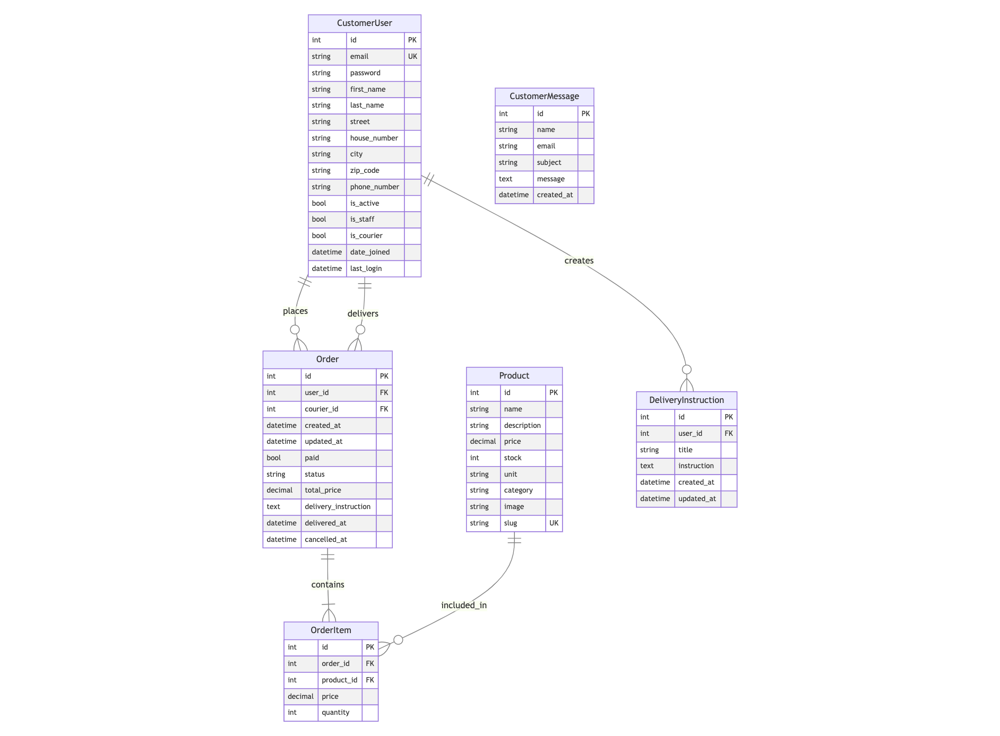

# Green Local Veggies

## Online Fresh Produce Delivery Platform

Green Local Veggies is a Django-based e-commerce application designed to facilitate the online ordering and delivery of fresh, locally-sourced fruits and vegetables in Westerstede, Germany. This project aims to bridge the gap between local farmers and urban consumers, promoting sustainable food practices and supporting the local economy.

### Project Overview

The Green Local Veggies platform offers a user-friendly interface for customers to browse, select, and purchase fresh produce online. It incorporates a robust backend system for order management, user authentication, and a courier dashboard for efficient delivery logistics. The application is built with scalability and maintainability in mind, utilizing modern web technologies and following best practices in web development.

[Live Demo](https://p4-green-local-veggies-c5f2f4c33912.herokuapp.com/)


### Key Features

- User authentication and profile management
- Product catalog with categories for fruits and vegetables
- Advanced search and filter capabilities
- Shopping cart functionality
- Secure checkout process with Stripe integration
- Order tracking for customers
- Staff dashboard for order management
- Courier dashboard for delivery management
- Responsive design for optimal viewing on various devices

### Target Audience

- Local residents of Westerstede seeking fresh, locally-sourced fruits and vegetables
- Health-conscious consumers interested in supporting local agriculture
- Busy professionals looking for convenient grocery shopping options
- Local farmers and produce suppliers seeking an online platform to reach customers


## Table of Contents

1. [Features](#features)
   - [Key Features Summary](#key-features-summary)
   - [Additional Features Summary](#additional-features-summary)

2. [User Experience (UX)](#user-experience-ux)
   - [Project Goals](#project-goals)
   - [User Stories](#user-stories)
   - [Design Choices](#design-choices)
   - [Wireframes](#wireframes)

3. [Information Architecture](#information-architecture)
   - [Flowchart](#flowchart)
   - [Database Schema (ERD Diagram)](#database-schema-erd-diagram)
   - [Data Models Description](#data-models-description)

4. [Technologies Used](#technologies-used)
   - [Languages](#languages)
   - [Frameworks & Libraries](#frameworks--libraries)
   - [Databases](#databases)
   - [Other Tools & Services](#other-tools--services)

5. [Agile Methodology](#agile-methodology)

6. [Version Control](#version-control)

7. [Deployment](#deployment)

8. [Forking and Local Setup](#forking-and-local-setup)

9. [Testing](#testing)

10. [Bugs and Fixes](#bugs-and-fixes)

11. [Unsolved Issues and Bugs](#unsolved-issues-and-bugs)

12. [Future Features](#future-features)

13. [Credits](#credits)
    - [Code](#code)
    - [Content](#content)
    - [Media](#media)
    - [Tools](#tools)
    - [Other Resources for Learning and Reference](#other-resources-for-learning-and-reference)
    - [Honourable Mentions](#honourable-mentions)
    - [Note on code used from third-party sources](#note-on-code-used-from-third-party-sources)


## Features

### Key Features Summary
    - Cookie consent banner for GDPR compliance saving the consent in the session;
    - Home page with product listings, search capabilities, pagination, and filtering options;
    - Product detail page with detailed information, quantity selector, product availability, and "Add to Cart" button;
    - User registration and login pages with form validation and error handling;
    - User session storage for persistent login and cart data;
    - User profile page with tabs for profile details, update profile, change password, and delete account;
    - Cart page with a comprehensive list of items, quantity adjustment, and subtotal calculation;
    - Checkout page with order summary, delivery instructions, delivery information, payment processing, and terms acceptance;
    - Order history page for users to view past transactions, order details, and cancel recent orders;
    - About page with company history, mission statement, and delivery information;
    - Contact page with a contact form and alternative contact methods;
    - Staff dashboard for order management, order status updates, user details, and courier assignments;
    - Courier dashboard for delivery management, delivery status updates, and navigation to delivery locations;
    - Django admin panel for superusers to manage users, orders, and products;
    - Customized error pages for 404 and 500 errors with user-friendly messages and navigation links;
    - Responsive design for optimal viewing on various devices, including desktops, tablets, and smartphones;

### Additional Features Summary
    - Toast notifications for feedback on all actions;
    - "Show in Cart" button on product cards for quick access to the cart once an item is added;
    - Quantity lock and "Current quantity in cart" for products already in the cart (on the product detail page);
    - Delivery instructions automatically selected upon editing;

Details about the features, their implementation, and the user experience can be found in the [Features](FEATURES.md) document.

[Go to Table of Contents](#table-of-contents)

## User Experience (UX)

### Project Goals

#### Site Owner Goals

- Establish an online presence for Green Local Veggies in Westerstede, Germany
- Create a platform that connects local farmers with urban consumers
- Promote sustainable food practices and support the local economy
- Provide a user-friendly interface for customers to browse and purchase fresh produce online
- Implement an efficient system for order management and delivery logistics
- Build a scalable and maintainable e-commerce solution
- Increase sales and customer base for local produce
- Offer a convenient alternative to traditional grocery shopping

#### User Goals

- Find and purchase fresh, locally-sourced fruits and vegetables conveniently online
- Support local farmers and sustainable agriculture practices
- Access detailed information about products, including origin and nutritional value
- Easily navigate through product categories and search for specific items
- Manage personal accounts, including order history and delivery preferences
- Experience a smooth and secure checkout process
- Receive timely updates on order status and delivery information
- Access the platform seamlessly across various devices (desktop, tablet, mobile)
- Provide feedback and communicate with the Green Local Veggies team
- Stay informed about seasonal offerings and special promotions

These project goals align with the overall mission of Green Local Veggies to bridge the gap between local farmers and urban consumers while promoting sustainable food practices. The site owner aims to create a robust, user-friendly platform that serves both the business objectives and the needs of the target audience, ultimately contributing to the local economy and encouraging healthier, more sustainable food choices.

### User Stories (in order of priority and relation to the project goals)
User stories are implemented in the project. The user stories are linked to the Github issues and the project board. When created, the user stories were prioritized based on their importance and relevance to the project goals using the MoSCoW method (Must have, Should have, Could have, Won't have). Story points were assigned to each user story to estimate the level of effort required for implementation. The user stories were then added to the project board and assigned to the appropriate project milestone for tracking progress.

[User Stories (Github issue)](https://github.com/zioan/pp4_GreenLocalVeggies/issues)
<br>
[Kanban Board (Github project)](https://github.com/users/zioan/projects/5)

#### 1. View Main Page with Products
As a Site User, I can view the main page displaying all products so that I can browse the available items.
##### Acceptance Criteria
- When a user visits the main page, a list of all available products is displayed.
- Each product listing includes a thumbnail image, name, price, and a brief description.
- The user can click on a product to view its detailed page.

#### 2. Search for Products
As a Site User, I can search for products so that I can quickly find items I am interested in.
##### Acceptance Criteria
- A search bar is available on the main page.
- When a user enters a search term, relevant products are displayed in the search results.
- The search results include product name, image, and price.

#### 3. Filer Products
As a Site User, I can filter products by category, price range, and availability so that I can easily find what I need.
##### Acceptance Criteria
- Filters for category and price range.
- When a filter is applied, the product listings update to show only the relevant products.

#### 4. View Product Details
As a Site User, I can click on a product so that I can read the full details.
##### Acceptance Criteria
- When a product title is clicked, a detailed view of the product is seen.
- The detailed view should include the product name, description, price, and available stock.
- The view should display an image of the product.
- The view should have an option to add the product to the cart.

#### 5. Account Registration
As a Site User, I can register an account so that I can place orders.
##### Acceptance Criteria
- Given an email, a user can register an account.
- Then the user can log in.
- When the user is logged in, they can place orders.

#### 6. User Profile Management
As a Site User, I can manage my profile so that I can update my personal information and view my order history.
##### Acceptance Criteria
- The user can update their personal information (name, email, address).
- The user can view their past orders and order details.

#### 7. Add to Cart
As a Site User, I can add products to my cart so that I can purchase them later.
##### Acceptance Criteria
- When a product is added to the cart, it appears in the cart with the correct quantity.
- The cart shows the total price of all added products.

#### 8. Product Recommendations
As a Site User, I can see product recommendations based on my browsing and purchase history so that I can discover new items.
##### Acceptance Criteria
- Recommendations are displayed on the product detail pages.

#### 9 Delivery Instructions
As a Customer, I can provide and save custom delivery instructions so that I can ensure my orders are delivered according to my preferences.
##### Acceptance Criteria:
- Customers can add (Create), view (Read), edit (Update), and Delete custom delivery instructions in their profile.
- Saved instructions can be selected during the checkout process.

#### 10. Checkout and Payment
As a Site User, I can checkout and make a payment so that I can complete my purchase.
##### Acceptance Criteria
- Given a filled cart, the user can proceed to checkout.
- The user can enter payment and shipping information.
- The user receives a confirmation message or some kind of notification upon successful payment.

#### 11. View Order History
As a Site User, I can view my order history so that I can keep track of my past purchases.
##### Acceptance Criteria
- Given a logged-in user, they can view a list of their past orders.
- Each order includes details such as order date, items purchased, total amount, and order status.

#### 12. Order Status Tracking
As a Customer, I can track the status of my order so that I know when to expect my delivery.
##### Acceptance Criteria:
- Customers can view the current status of their order (e.g., processing, delivered).

#### 13. Staff Member Dashboard
As a Staff Member, I can access a comprehensive dashboard so that I can manage orders.
##### Acceptance Criteria:
- Staff members can log in to a secure, role-specific dashboard.
- The dashboard provides an overview of current orders and their statuses.

#### 14. Courier Dashboard
As a Courier, I can access a dedicated dashboard so that I can manage and track my delivery tasks efficiently.
##### Acceptance Criteria:
- Couriers can log in to a secure, role-specific dashboard.
- The dashboard displays a list of pending deliveries assigned to the courier.
- The dashboard provides a map or navigation assistance for delivery routes.
- Couriers can view customer contact information for each delivery.

#### 15. Admin dashboard (Django Admin Panel)
As a Site Admin, I can access an admin dashboard so that I can manage products, orders, and users efficiently.
##### Acceptance Criteria
- The admin dashboard provides an overview (sales, orders).
- Admins can navigate to different sections to manage products and orders.

##### 16. Manage Products (Django Admin Panel - early implementation)
As a Site Admin, I can create, read, update, and delete products so that I can manage my inventory.
##### Acceptance Criteria
- Given a logged-in admin, full CRUD access and functionality over the products must be provided.

A complete list of user stories (including not implemented ones) can be found in the [Issues](https://github.com/zioan/pp4_GreenLocalVeggies/issues) section of the project repository.


### Design Choices
#### Color Scheme
The color scheme for Green Local Veggies has been carefully selected to reflect the natural, fresh, and organic qualities of the products.


#### Typography
For this project, I have chosen Roboto as the primary font for its modern, clean, and versatile design. Roboto offers excellent legibility and readability across various devices and screen sizes.

#### Imagery
The imagery used throughout the Green Local Veggies website is carefully curated to showcase the product quality.
More info on the images used in the project can be found in the Credits section.


### Wireframes
To ensure a responsive and user-friendly design across various devices, wireframes were created for mobile and desktop views. These wireframes serve as a blueprint for the layout and structure of key pages in the Green Local Veggies e-commerce platform.

#### Mobile Design
The mobile design focuses on a streamlined, vertical layout that prioritizes essential information and easy navigation for users on smaller screens.

Key features of the mobile design include:

A hamburger menu for compact navigation
Large, touch-friendly product cards

#### Desktop Design
The desktop design offers the full experience, with a spacious layout that showcases products and allows for easy browsing and purchasing.

Desktop design features:

Full navigation menu
Three or four-column product grid

#### Key Pages Wireframed:

Home Page


Product Detail Page


Shopping Cart


Checkout Page


User Profile


These wireframes were created using [Balsamiq](https://balsamiq.com/wireframes/).

#### Wireframe to Implementation
As the project progresses, these wireframes serve as a guide for the development. However, it's important to note that the final implementation may vary slightly from these initial designs as I iterate and refine the user experience based on testing.

[Go to Table of Contents](#table-of-contents)

## Information Architecture
### Flowchart

To visualize the structure and user flow of the Green Local Veggies application, I created a flowchart using [Lucidchart](https://www.lucidchart.com/pages/). This flowchart illustrates the main processes and decision points within the application.


### Database Schema (ERD Diagram)


### Data Models Description
#### PRODUCT
Represents the items available for purchase on the platform.

- ID: Primary key, unique identifier for each product
- Name: String, name of the product
- Description: Text, detailed description of the product
- Price: Decimal, price of the product
- Stock: Integer, current available quantity of the product
- Unit: String, unit of measurement for the product (e.g., kg, piece)
- Category: String, category of the product
- Image: String, path or URL to the product image
- Slug: String, URL-friendly version of the product name

#### CUSTOMERUSER
Represents registered users of the Green Local Veggies platform, including customers, staff, and couriers.

- ID: Primary key, unique identifier for each user
- FirstName: String, user's first name
- LastName: String, user's last name
- Street: String, street name of user's address
- HouseNumber: String, house number of user's address
- City: String, city of user's address
- ZipCode: String, zip code of user's address
- Email: String, user's email address
- PhoneNumber: String, user's contact number
- IsActive: Boolean, indicates if the user account is active
- IsStaff: Boolean, indicates if the user has staff privileges
- IsCourier: Boolean, indicates if the user is a courier
- DateJoined: DateTime, date and time when the user registered
- LastLogin: DateTime, date and time of the user's last login

#### ORDER
Represents a customer's order.

- ID: Primary key, unique identifier for each order
- User: Foreign key, references the CUSTOMERUSER who placed the order
- CreatedAt: DateTime, timestamp of when the order was created
- UpdatedAt: DateTime, timestamp of the last update to the order
- Paid: Boolean, indicates if the order has been paid for
- Status: String, current status of the order (e.g., "Pending", "Shipped", "Delivered")
- TotalPrice: Decimal, total cost of the order
- DeliveryInstruction: Text, custom instructions for order delivery
- Courier: Foreign key, references the CUSTOMERUSER who is assigned to deliver the order
- DeliveredAt: DateTime, timestamp of when the order was delivered
- CancelledAt: DateTime, timestamp of when the order was cancelled (if applicable)

#### ORDERITEM
Represents individual items within an order.

- ID: Primary key, unique identifier for each order item
- Order: Foreign key, references the ORDER this item belongs to
- Product: Foreign key, references the PRODUCT in this order item
- Price: Decimal, price of the product at the time of order
- Quantity: Integer, quantity of the product in this order item

#### DELIVERYINSTRUCTION
Represents saved delivery instructions for a user.

- ID: Primary key, unique identifier for each delivery instruction
- User: Foreign key, references the CUSTOMERUSER who created the instruction
- Title: String, short title or name for the delivery instruction
- Instruction: Text, detailed delivery instructions
- CreatedAt: DateTime, timestamp of when the instruction was created
- UpdatedAt: DateTime, timestamp of the last update to the instruction

#### CUSTOMERMESSAGE
Represents messages sent by users through the contact form.

- ID: Primary key, unique identifier for each message
- Name: String, name of the person sending the message
- Email: String, email address of the sender
- Subject: String, subject of the message
- Message: Text, content of the message
- CreatedAt: DateTime, timestamp of when the message was sent

### Database Relationships

#### CUSTOMERUSER to ORDER: One-to-Many

A CUSTOMERUSER can place multiple ORDERs, but each ORDER belongs to only one CUSTOMERUSER.
This relationship is represented by the foreign key 'User' in the ORDER model.


#### CUSTOMERUSER to DELIVERYINSTRUCTION: One-to-Many

A CUSTOMERUSER can create multiple DELIVERYINSTRUCTIONs, but each DELIVERYINSTRUCTION belongs to only one CUSTOMERUSER.
This relationship is represented by the foreign key 'User' in the DELIVERYINSTRUCTION model.


#### ORDER to ORDERITEM: One-to-Many

An ORDER can contain multiple ORDERITEMs, but each ORDERITEM belongs to only one ORDER.
This relationship is represented by the foreign key 'Order' in the ORDERITEM model.


#### PRODUCT to ORDERITEM: One-to-Many

A PRODUCT can be included in multiple ORDERITEMs, but each ORDERITEM refers to only one PRODUCT.
This relationship is represented by the foreign key 'Product' in the ORDERITEM model.


This database schema provides a comprehensive structure for the Green Local Veggies e-commerce platform. It supports key functionalities such as:

- User management with different roles (customer, staff, courier)
- Product catalog with detailed product information
- Order processing with line items and delivery instructions
- Saved delivery instructions for repeat customers

[Go to Table of Contents](#table-of-contents)

## Technologies Used
### Languages
- HTML5
- CSS3
- JavaScript
- Python 3.8+

### Frameworks & Libraries
- Django 5.0.6 - High-level Python web framework that encourages rapid development and clean, pragmatic design;
- Bootstrap 5.2 - Front-end framework for developing responsive and mobile-first websites;
- Cloudinary 1.40.0 - Cloud service that offers a solution to a web application's entire image management pipeline;
- django-cloudinary-storage 0.3.0 - Django package that facilitates integration with Cloudinary;
- Gunicorn 22.0.0 - Python WSGI HTTP Server for UNIX, used to run Python web applications on Heroku;
- Pillow 10.4.0 - Python Imaging Library (PIL), adding image processing capabilities to Python interpreter;
- Whitenoise 6.7.0 - Allows Django apps to serve its own static files, making it self-contained and easier to deploy;
- Stripe 10.6.0 - Payment processing platform for online businesses.

### Databases
- SQLite (development) - Lightweight disk-based database that doesn't require a separate server process;
- PostgreSQL (production) - Powerful, open-source object-relational database system.

### Other Tools & Services
- Git - Version control system for tracking changes in source code during software development;
- GitHub - Internet hosting service for software development, version control using Git, user stories (Issues), and project management;
- Heroku - Cloud platform used to deploy the Green Local Veggies application;
- Stripe - Payment processing platform for online businesses;
- Cloudinary - Cloud-based image and video management service;
- Balsamiq - Wireframing tool for creating low-fidelity wireframes;
- Google Fonts - Library of free and open-source font families;
- Font Awesome - Icon toolkit for web development;
- dj-database-url 2.2.0 - Utility to help configure Django application database from the DATABASE_URL environment variable;
- psycopg2-binary 2.9.9 - PostgreSQL adapter for Python.

[Go to Table of Contents](#table-of-contents)

## Agile Methodology

This project was developed using Agile methodology, focusing on iterative development and flexibility to adapt to changes throughout the development process.

### Project Management

- **Tool Used**: GitHub Projects
- **Link to Project Board**: [Kanban Board](https://github.com/users/zioan/projects/5)

### User Stories

User Stories were created as GitHub Issues and managed through the project board. Each user story was assigned a priority label using the MoSCoW method:

- Must Have
- Should Have
- Could Have
- Won't Have (this time)

### Kanban Board

The Kanban board consisted of the following columns:

1. **Backlog**: All user stories
2. **ToDo**: User stories for the current sprint
3. **In Progress**: Stories actively being worked on
4. **In Review**: Stories ready for testing
5. **Done**: Completed stories

### Milestones

Milestones were used to mark significant points in the project development:

- MVP (Minimum Viable Product)
- User Experience Enhancements
- Optional Features
- Promotional Features

### Agile Approach Benefits

By using Agile methodology, I was able to:

- Respond quickly to changes in requirements
- Deliver working features incrementally
- Maintain a clear overview of project progress
- Prioritize features effectively based on their importance and complexity

[Go to Table of Contents](#table-of-contents)

## Version Control

Throughout the development process, I used Git for version control, with Visual Studio Code as my primary development environment (MacOS 14.6.1). This setup allowed me to manage my code efficiently. Here's an overview of my workflow:

1. **Development in VS Code**: 
   I used VS Code as my main IDE for writing and editing Django code. The integrated terminal allowed me to run Django commands and manage my virtual environment easily.

2. **Leveraging VS Code's Source Control**:
   VS Code's Source Control panel was instrumental in managing changes across my complex Django project structure. After making significant changes involving multiple apps, views, and URL configurations, I used the Source Control panel to review all modifications in one place. This comprehensive view helped me logically group changes into meaningful commits, ensuring that each commit represented a coherent unit of work despite the intricate relationships in Django.

3. **Commit Strategy**:
   Given Django's interconnected nature, I often made changes across multiple files (e.g., models, views, templates, and URLs) for a single feature. VS Code's diff viewer allowed me to carefully review these changes, helping me create commits that encapsulated related modifications across different parts of the project. I aimed to create descriptive commit messages that explained the purpose of each set of changes, making it easier to understand the project's evolution and helping maintainability.

4. **Key Git Commands**:
   I frequently used the following Git commands:
   - `git add <file>` or `git add .`: To stage specific files or all changes.
   - `git commit -m "descriptive message"`: To create a commit with a meaningful message.
   - `git push`: To push changes to my remote repository.

5. **Syncing with Remote**:
   I regularly used `git pull` to keep my local repository up-to-date with the remote, especially after making changes in the project's GitHub repository (Kanban board) or Issues. This practice helped me avoid conflicts and stay aligned with the latest changes.

By leveraging VS Code's Git integration and following these practices, I maintained a clean and understandable version history throughout my project's development, even as I worked with Django's complex structure and interconnected components.

[Go to Table of Contents](#table-of-contents)

## Deployment

I deployed this Django application on Heroku, taking advantage of its integration with GitHub. Here's a step-by-step overview of my deployment process:

1. **Heroku App Creation**:
   I logged into my Heroku dashboard and clicked "New" > "Create new app". I chose a unique app name and selected the appropriate region.

2. **GitHub Integration**:
   In the app's "Deploy" tab, I selected GitHub as the deployment method. I connected to my GitHub account and selected the repository containing my Django app.

3. **Environment Configuration**:
   In the "Settings" tab, I clicked on "Reveal Config Vars" and added the necessary environment variables:

- `SECRET_KEY`: My Django secret key
- `DATABASE_URL`: The URL provided by Code Institute for the database
- `CLOUDINARY_URL`: The URL provided by Cloudinary for image storage
- `STRIPE_PUBLISHABLE_KEY`: My Stripe publishable key
- `STRIPE_SECRET_KEY`: My Stripe secret key

4. **Database Configuration**:
   Since my database is provided by Code Institute, I ensured the `DATABASE_URL` in Config Vars was correctly set to the provided database URL. In my Django settings, I made sure to use this environment variable to configure the database connection.

5. **Buildpack Configuration**:
   Still in the "Settings" tab, I scrolled to the "Buildpacks" section, clicked "Add buildpack", and selected "heroku/python".

6. **Deployment Configuration**:
   In the "Deploy" tab, under "Deployment method", I confirmed that GitHub was selected. In the "App connected to GitHub" section, I ensured my repository was selected.

7. **Manual Deploy**:
   I scrolled to the "Manual deploy" section, chose the `main` branch, and clicked "Deploy Branch".

8. **Verify Deployment**:
   Once the deployment was complete, I clicked "View" to open my app and verify it was working correctly.

[Go to Table of Contents](#table-of-contents)

## Forking and Local Setup

If you'd like to fork this repository and run it locally, follow these steps:

1. **Fork the Repository**:
   - Navigate to the GitHub repository: [Green Local Veggies repository](https://github.com/zioan/pp4_GreenLocalVeggies)
   - In the top-right corner of the page, click the "Fork" button.
   - This will create a copy of the repository in your GitHub account.

2. **Clone Your Fork**:
   - On your forked repository page, click the "Code" button and copy the URL.
   - Open your terminal and run:
     ```
     git clone [URL you just copied]
     ```
   - This creates a local copy of the repository on your machine.

3. **Set Up Virtual Environment**:
   - Navigate into the project directory:
     ```
     cd [project directory name]
     ```
   - Create a virtual environment:
     ```
     python -m venv venv
     ```
   - Activate the virtual environment:
     - On Windows: `venv\Scripts\activate`
     - On macOS and Linux: `source venv/bin/activate`

4. **Install Dependencies**:
   - With your virtual environment activated, install the required packages:
     ```
     pip install -r requirements.txt
     ```

5. **Set Up Environment Variables**:
   - Create a `env.py` file in the root directory of the project.
   - Add the following variables (replace with your actual values):
     ```
     SECRET_KEY=your_secret_key
     DATABASE_URL=your_database_url
     CLOUDINARY_URL=your_cloudinary_url
     STRIPE_PUBLISHABLE_KEY=your_stripe_publishable_key
     STRIPE_SECRET_KEY=your_stripe_secret_key
     DEBUG=True
     ```
    Important Notes: 
    - Make sure to set `DEBUG=True` for local development and testing in `env.py`. In `settings.py`, DEBUG mode will be automatically recognized for the development environment based on the presence of the `DEBUG` variable in `env.py`.
    - Remember to never commit the `env.py` file or any sensitive information to version control. If you plan to deploy your fork, make sure to set up the necessary environment variables in your deployment environment.

    Note on automated testing: Automated tests are present for all apps in the project. To run the tests run `python manage.py test` in the terminal.

6. **Apply Migrations**:
   - Run the following commands to apply database migrations:
     ```
     python manage.py makemigrations
     python manage.py migrate
     ```

7. **Run the Development Server**:
   - Start the Django development server:
     ```
     python manage.py runserver
     ```
   - Open a web browser and navigate to `http://127.0.0.1:8000/` to view the application.

[Go to Table of Contents](#table-of-contents)

## Testing

Comprehensive testing has been conducted to ensure the functionality, usability, and reliability of this Django e-commerce application. My testing approach includes:

- Code Validation: Ensuring adherence to best practices and standards
- Lighthouse Testing: Performance, accessibility, best practices, SEO
- User Story Testing: Verification of features against defined user stories
- Manual Testing: Thorough checks across various browsers
- Automated Testing: Automated tests for critical components

For detailed information on the testing procedures, results, and ongoing test plans, please refer to the [TESTING.md](TESTING.md) file. This document provides in-depth coverage of the testing methodologies, including specific test cases, browser compatibility results, and the outcomes of the automated test suites.

Note on testing delivery functionality:

Since Green Local Veggies is intended to sell products in a specific area, a customer should register only if the delivery address matches the area (26655 Westerstede - Germany). The system does not check the delivery address when a customer registers. If a fictitious street name and house number are entered, this can influence the ability of "Go to address" from the courier dashboard to work correctly. Using the demo accounts with the delivery address already set up is recommended for testing the full functionality of the application. The "Go to address" button in the courier dashboard uses Google Maps to generate a route from the courier's location to the delivery address.

[Go to Table of Contents](#table-of-contents)

## Bugs and Fixes

Throughout the development process, several bugs were encountered and resolved. Here are some of the most notable ones:

### Stock Not Checked and Updated Upon Order Placement
**Bug**: The system was not verifying product stock levels or updating the inventory when an order was placed. This could lead to overselling products and inconsistencies between the actual stock and what was displayed on the website.

**Fix**: Implemented stock checking and updating logic in the order placement process. The following changes were made:

1. Added a stock check before finalizing the order:
```python
for item in cart:
    product = item['product']
    if product.stock < item['quantity']:
        messages.error(
            request,
            f"Sorry, we don't have enough stock for {product.name}."
        )
        return redirect('cart_detail')
```

2. Implemented stock update after successful order creation:
```python
for item in cart:
    product = item['product']
    quantity = item['quantity']
    product.stock -= quantity
    product.save()
```

3. Modified the Product model to include a method for checking stock availability:
```python
def check_stock(self, quantity):
    if self.stock >= quantity:
        return True
    else:
        return False
```

This enhancement ensures that:

- Orders are only placed when sufficient stock is available for all items in the cart.
- Product stock levels are accurately updated after each successful order.
- Customers are informed immediately if a product is out of stock or if their requested quantity exceeds available stock.


### Duplicated Categories in Category Filter
**Bug**: The category filter in the product listing was showing duplicate categories. This occurred because the query to fetch categories wasn't properly handling cases where multiple products have the same category, leading to redundant entries in the filter options.

**Fix**: Modified the category query in the index view to eliminate duplicates and sort the categories. The following change was made:

```python
# Before:
categories = Product.objects.values_list('category', flat=True).distinct()

# After:
categories = Product.objects.values_list(
    'category', flat=True).distinct().order_by('category')
```
This enhancement:

1. Uses distinct() to remove any duplicate category entries.
2. Adds order_by('category') to sort the categories alphabetically.

The fix ensures that:

- Each category appears only once in the filter options.
- Categories are presented in a consistent, alphabetical order.
- The user experience is improved with a clean, organized category filter.


### Inconsistent Order Filtering for Staff Dashboard
**Bug**: The staff dashboard was not properly filtering and ordering orders, leading to inconsistent and potentially confusing displays of order information. This made it difficult for staff members to efficiently manage and track orders.

**Fix**: Implemented consistent order filtering and sorting across the staff dashboard. The following changes were made:

1. Updated the order queryset in various views to use consistent filtering and ordering:
```python
orders = Order.objects.filter(status=status).order_by('-created_at')
```

2. Added status-specific filtering to relevant views:
```python
if status == 'processing':
    orders = orders.filter(status='processing')
elif status == 'out_for_delivery':
    orders = orders.filter(status='out_for_delivery')
# ... (similar filters for other statuses)
```

3. Implemented a default ordering for orders when no specific status is selected:
```python
else:
    orders = Order.objects.all().order_by('-created_at')
```

4. Updated the context data to include the current status for maintaining filter state:
```python
context = {
    'orders': orders,
    'current_status': status,
}
```

These enhancements ensure that:

- Orders are consistently sorted by creation date (most recent first) across all dashboard views.
- Staff can easily filter orders by specific statuses (e.g., processing, out for delivery).
- The dashboard maintains the selected filter state, improving usability when navigating between pages.
- When no specific status is selected, all orders are displayed in a consistent, chronological order.

This fix significantly improves the staff's ability to manage orders efficiently, providing a more organized and user-friendly dashboard experience.


### Incorrect Order Status Update in Staff Dashboard
**Bug**: The staff dashboard was not correctly updating the order status when staff members tried to change it. This led to inconsistencies between the displayed status and the actual status in the database, causing confusion and potential issues in order processing.

**Fix**: Implemented a robust order status update mechanism in the staff dashboard.

The following changes were made:

1. Created a new view function update_order_status to handle status updates:
```python
@staff_member_required
def update_order_status(request, order_id):
    if request.method == 'POST':
        order = get_object_or_404(Order, id=order_id)
        new_status = request.POST.get('status')
        if new_status in dict(Order.STATUS_CHOICES):
            order.status = new_status
            order.save()
            messages.success(request, f'Order status updated to {order.get_status_display()}')
        else:
            messages.error(request, 'Invalid status')
    return redirect('staff_dashboard:order_detail', order_id=order_id)
```

2. Updated the order detail template to include a form for status updates:
```html
<form method="post" action="">
    
    <select name="status" class="form-select">
        
            <option value="{{ status }}" selected>
                {{ display }}
            </option>
        
    </select>
    <button type="submit" class="btn btn-primary mt-2">Update Status</button>
</form>
```

3. Added a new URL pattern in the staff_dashboard urls.py:
```python
path('order/<int:order_id>/update_status/', views.update_order_status, name='update_order_status'),
```

4. Implemented proper error handling and success messages to provide feedback to staff members.

These enhancements ensure that:

- Staff members can easily update order statuses from the order detail page.
- The system validates the new status before updating to prevent invalid status assignments.
- The database is correctly updated with the new status.
- Staff members receive immediate feedback on the success or failure of the status update.
- The order detail page reflects the updated status immediately after the change.

This fix significantly improves the accuracy and reliability of order management in the staff dashboard, reducing errors and improving the overall efficiency of order processing.


### Empty Cart Checkout Prevention and Back Button Handling
**Bug**: Users could proceed to checkout with an empty cart, and the back button behavior after payment was inconsistent, potentially leading to confusion and errors in the ordering process.

**Fix**: Implemented checks to prevent checkout with an empty cart and improved back button handling after payment. The following changes were made:

1. Added a cart length check in the checkout view:
```python
@login_required
def checkout(request):
    cart = Cart(request)
    if len(cart) == 0:
        messages.warning(request, "Please add items before checking out.")
        return redirect('cart_detail')
    # ... rest of the checkout logic
```

2. Implemented a JavaScript function to check cart total and redirect if necessary:
```javascript
function checkCartAndRedirect() {
    const cartTotal = document.getElementById('cart-total');
    if (cartTotal && parseFloat(cartTotal.textContent) === 0) {
        window.location.href = '/cart/';
    }
}
```
3. Added event listeners for document visibility and browser navigation:
```javascript
document.addEventListener('visibilitychange', function () {
    if (!document.hidden) {
        checkCartAndRedirect();
    }
});

window.onpopstate = function () {
    checkCartAndRedirect();
    window.history.pushState(null, "", window.location.href);
};
```

4. Integrated the cart check into the page load process:
```javascript
document.addEventListener('DOMContentLoaded', function () {
    checkCartAndRedirect();
    // ... other initialization code
});
```

These enhancements ensure that:

- Users cannot proceed to checkout with an empty cart, preventing potential errors in the order process.
- A warning message is displayed when attempting to check out with an empty cart, guiding users to add items first.
- The back button behavior after payment is consistent, preventing users from returning to an invalid checkout state.
- The cart is checked when the page becomes visible or when using browser navigation, maintaining a consistent state.

This fix significantly improves the user experience by preventing common pitfalls in the checkout process and ensuring that the cart state remains valid throughout the user's journey on the site.


### Missing Validation Alert for Profile Update Form
**Bug**: The update profile form lacked clear feedback when users submitted invalid data. This could lead to confusion as users wouldn't understand why their profile updates weren't being saved or what specific fields needed correction.

**Fix**: Implemented a validation alert message for the update-profile form. The following changes were made:

1. Added a conditional check for form errors: ``
2. Inserted an alert div with appropriate Bootstrap classes for styling and accessibility:
```html
<div class="alert alert-danger text-center" role="alert">
    Invalid fields in your profile update.
    <br>
    Please check the errors below.
</div>
```
3. Enclosed the alert within an endif block to ensure it only displays when there are form errors.

This enhancement provides users with immediate, visible feedback when their profile update submission contains errors, improving the overall user experience and reducing potential frustration during the profile update process.


## Unsolved Issues and Bugs

The following bugs have been identified in the application. Due to time constraints, these issues have not been resolved but are acknowledged and will be addressed in future updates.

1. **Pluralization of "piece" unit:**
   - **Description:** When displaying quantities of items with the unit "piece", the application does not correctly pluralize to "pieces" for quantities greater than one.
   - **Affected areas:** This issue appears in the cart summary, order details, and notifications.
   - **Impact:** While this does not affect the functionality of the shop, it may cause minor confusion in reading product quantities.
   - **Planned fix:** Implement a custom pluralization logic for units, particularly handling the "piece" to "pieces" conversion when quantities exceed one.

[Go to Table of Contents](#table-of-contents)

## Future Features

Some of the features described below were initially conceptualized in my project planning phase and can be found in the GitHub project's user stories and issues. Due to time constraints, some features weren't implemented in the current version. For a comprehensive list of planned features and their current status, please visit the [GitHub Project Board](https://github.com/users/zioan/projects/5) and [Issues page](https://github.com/zioan/pp4_GreenLocalVeggies/issues). These resources provide insight into my development process and future directions for Green Local Veggies.

These features would significantly enhance the functionality, user experience, and administrative capabilities of the Green Local Veggies platform:

### Shop and Customer Experience

1. **Email Confirmation and Notifications**
   - Implement email confirmation for user registration
   - Send order confirmation and shipping update emails
   - Provide email notifications for price drops on favorite items

2. **Enhanced User Accounts**
   - Allow social media login integration (Google, Facebook, etc.)
   - Implement a "Forgot Password" feature
   - Enable users to manage multiple delivery addresses

3. **Improved Shopping Experience**
   - Add a wishlist feature for users to save items for later
   - Create a "Frequently Bought Together" section for product recommendations

4. **Reviews and Ratings**
   - Allow customers to leave reviews and ratings for products
   - Add a feature for customers to upload photos in their reviews

5. **Personalization**
   - Develop a recommendation engine based on past purchases
   - Implement personalized email marketing campaigns
   - Create customizable produce boxes based on customer preferences
   - Add a "Subscribe and Save" option for recurring orders
   - Develop a "Quick Reorder" feature for frequently purchased items
   - Implement a "Notify Me" feature for out-of-stock products

6. **Subscription Services**
   - Offer weekly or monthly subscription boxes
   - Implement a "Pause" or "Skip" feature for subscriptions
   - Provide customizable subscription options (e.g., all-fruit, all-vegetable, mixed)

### Operational Improvements

7. **Advanced Order Management**
   - Allow customers to modify orders within a certain timeframe
   - Develop a system for handling backorders and pre-orders

8. **Inventory and Supplier Management**
    - Create an automated inventory tracking and reordering system
    - Develop tools for predicting inventory needs based on historical data and seasonality
    - Enhance Django admin panel for managing suppliers and product catalogs

9. **Enhanced Staff Dashboard**
    - Create a comprehensive analytics dashboard with sales trends and customer insights
    - Implement a customer service ticket system
    - Develop tools for managing and optimizing product promotions

10. **Improved Courier System**
    - Implement real-time order tracking for customers
    - Develop a route optimization algorithm for efficient deliveries

### General Improvements

11. **Multi-language Support**
    - Implement a language selection feature for the website
    - Provide product descriptions in multiple languages

12. **Sustainability Features**
    - Add a carbon footprint calculator for orders
    - Create a system for customers to return packaging for reuse

These future features represent my vision for the continued evolution of the project, and can be successfully transformed in a profitable and sustainable SaaS platform.

[Go to Table of Contents](#table-of-contents)

## Credits

### Code

- The implementation of the shopping cart functionality was inspired by this article found on [dev.to](https://dev.to/nick_langat/building-a-shopping-cart-using-django-rest-framework-54i0).
- The custom user model and authentication system was developed with guidance from the [Django Custom User Model](https://learndjango.com/tutorials/django-custom-user-model) tutorial by William S. Vincent.
- The components design was adapted from the [Bootstrap documentation](https://getbootstrap.com/docs/5.0/components/).
- The AJAX functionality for updating cart items without page refresh was implemented using techniques from [Real Python's AJAX with Django tutorial](https://realpython.com/django-and-ajax-form-submissions/).
- The product filtering system was built following the [Django Filters tutorial](https://django-filter.readthedocs.io/en/stable/guide/usage.html) in the official documentation.
- Stripe payment integration was accomplished with help from [Stripe Django integration guide](https://stripe.com/docs/payments/accept-a-payment?platform=web&ui=elements) and [Unlocking E-commerce: Stripe Payment Gateway with Python](https://medium.com/@nikhilwani05/stripe-payment-gateway-with-python-caad352d008c).

Code snippets suggested and used from ChatGpt:

- 

- 

- 

- 

### Content

- The content for this application was created by me.

### Media

- The vegetables and fruits images used throughout the application were sourced from [transparentimagesclub.com](https://www.transparentimagesclub.com/), a paid stock images service that I purchased years ago waiting for the right project to use them.
- The images from the About page were sourced from [Unsplash](https://unsplash.com/).
- Icons used in the UI were provided by [Font Awesome](https://fontawesome.com/).

### Tools

- [Coolors](https://coolors.co/) was used to generate the color palette for the application, which I fine-tuned to match my design preferences and Bootstrap components.
- Database schema was designed using [mermaidflow.app](https://www.mermaidflow.app).
- The Flowchart was created using [Lucidchart](https://www.lucidchart.com/).
- Wireframes were created using [Balsamiq](https://balsamiq.com/).
- The favicon was created using [gauger.io](https://gauger.io/fonticon/), a tool that generates favicons from fontawesome icons.
- The image from the top of this document with responsive devices was created using [Am I Responsive](https://ui.dev/amiresponsive).

### Other Resources for Learning and Reference

- [Code Institute learning materials](https://codeinstitute.net/).
- [Python Django - The Practical Guide](https://www.udemy.com/course/python-django-the-practical-guide/): A comprehensive course on Django web development.
- [Django Documentation](https://docs.djangoproject.com/): Official documentation for Django web framework.
- [Python.org](https://www.python.org/): Official website for Python programming language.
- [Bootstrap Documentation](https://getbootstrap.com/docs/5.0/getting-started/introduction/): Official documentation for Bootstrap front-end framework.
- [Stripe Documentation](https://docs.stripe.com/): Comprehensive guides and API references for Stripe payment processing.
- [Cloudinary Documentation](https://cloudinary.com/documentation): Resources for Cloudinary image and video management.
- [This article](https://www.w3schools.com/js/js_cookies.asp) from W3Schools was used to implement the cookie consent logic.
- [Font Awesome Icons](https://fontawesome.com/icons): Icon toolkit for web development.
- [Google Fonts](https://fonts.google.com/): Library of free and open-source font families.
- [MDN Web Docs](https://developer.mozilla.org/): Valuable reference for JavaScript documentation.
- [CSS-Tricks](https://css-tricks.com/): Helpful resource for CSS styling and responsive design principles.
- [W3Schools](https://www.w3schools.com/): Comprehensive references for HTML, CSS, and JavaScript.
- [Can I Use](https://caniuse.com/): Essential resource for checking browser compatibility.
- [Google search engine](https://www.google.com/): For general research.
- [ChatGpt](https://chatgpt.com/): For fast answers to coding questions, small debugging sessions, quick implementation ideas, and general advice about best practices.

### Honourable Mentions

- I would like to thank my Code Institute mentor, Spencer Barriball, for his invaluable feedback and guidance throughout the development process.
- My colleague and Code Institute student, Lorenz Bchtold, for invaluable feedback and guidance for the Agile Methodology and the project management. [Github](https://github.com/Lorenz-127) [LinkedIn](https://www.linkedin.com/in/lorenz-b-swe/)
- My Cohort Facilitator from Code Institute, [Kristyna Wach](https://www.linkedin.com/in/kristyna-wach/), for weekly invaluable feedback and general guidance.
- Last but not least, Daisy Mc Girr for her support in implementing Cloudinary in my project, as well as her invaluable tutorials on [YouTube](https://www.youtube.com/@IonaFrisbee).


### Note on code used from third-party sources

No code was literally copy-pasted from those mentions, but it was used to get ideas and suggestions, except for the code mentioned above in this Credits section.

[Go to Table of Contents](#table-of-contents)

[Back to top](#green-local-veggies)